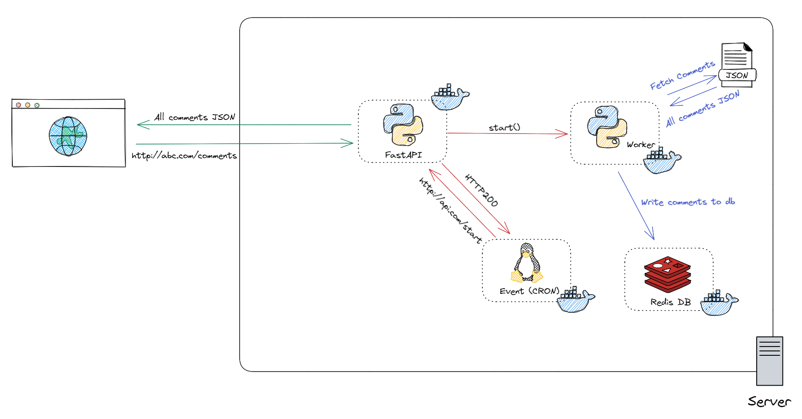

# Redis_OM / RQ / FastAPI

Example FastAPI application that uses with RQ for message queuing, and Redis_OM for object mapping. This example uses [JSONPlaceholder's comments](https://jsonplaceholder.typicode.com/comments) as example data.

## Overview

## Requirements

Docker - https://docs.docker.com/desktop/

## Running

    git clone this_repo
    cd this_repo
    docker-compose build && docker-compose up -d

Re-fetch data

    curl -X POST http://your_host:8000/start

## Usage

Data can be viewed via Redis Insight, included with Redis Stack.

`http://localhost:8001`
